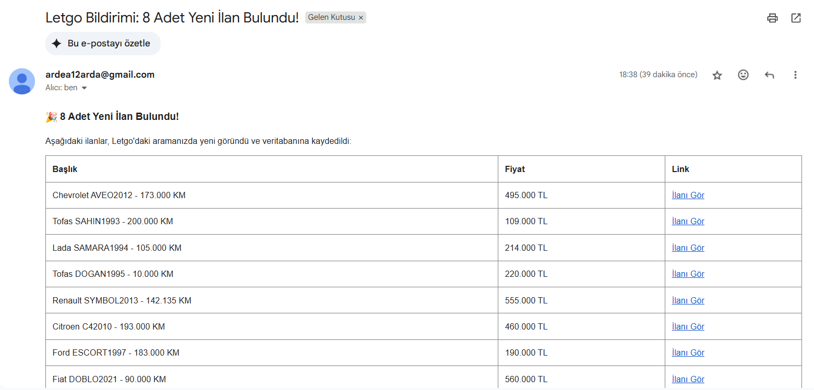

# Letgo Otomatik İlan Takip ve Bildirim Botu

Bu proje, Python ve modern web scraping teknikleri kullanılarak geliştirilmiş, **dinamik web sitelerinden belirli kriterlere uyan ilanları çeken ve anında e-posta ile bildirim gönderen** uçtan uca bir otomasyon sistemidir. Proje, bir web arayüzü (Flask) üzerinden kolayca yönetilebilir.


## Özellikler

- Dinamik Veri Çekme: Bot korumalı sitelere karşı Selenium ve Selenium Stealth teknikleri kullanılarak ilan verileri güvenle çekilir.

- Akıllı Veritabanı: SQLite3 ile sadece yeni ve benzersiz ilanlar kaydedilir. Mükerrer (tekrar eden) ilanlar için bildirim gönderilmez.

- Anlık E-posta Bildirimi: Yeni bir ilan bulunduğunda, ilan detaylarını içeren profesyonel HTML tabanlı bir e-posta anında belirlenen adrese gönderilir.

- Web Kontrol Paneli: Flask framework'ü sayesinde botu tarayıcı üzerinden kolayca başlatma imkanı sunulur.

  
## Kullanılan Teknolojiler

| Kategori | Teknoloji | Amaç |
| :--- | :--- | :--- |
| **Web Scraping** | Python, Selenium, Selenium Stealth | Dinamik içerik çekme ve bot tespitini aşma |
| **Veri Analizi** | BeautifulSoup | Çekilen HTML içeriğinden kritik veriyi ayrıştırma (parsing) |
| **Veritabanı** | SQLite3 | Yerel veri depolama ve ilan takibi |
| **Arayüz** | Flask | Web üzerinden botu tetikleyen API ve basit arayüz sağlama |
| **Bildirim** | smtplib | Gmail üzerinden güvenli (TLS) e-posta gönderimi |

  
## Kullanım/Örnekler

```javascript
import Component from 'benim-projem'

function App() {
  return <Component />
}
```

  
## Yol haritası

- Ek tarayıcı desteği

- Daha fazla entegrasyon ekleme

  
## Bilgisayarınızda Çalıştırın

Bu projeyi yerel makinenizde çalıştırmak için aşağıdaki adımları sırasıyla uygulayın.

### Adım 1: Projeyi Klonlama

Terminalinizi açın ve projeyi GitHub'dan indirin:

```bash
git clone <https://github.com/toramanarda/LetgoAracTakipSistemi>
cd <LetgoAracTakipSistemi>

# Sanal Ortamı Oluşturma
python -m venv venv

# Sanal Ortamı Etkinleştirme (Windows)
.\venv\Scripts\activate

# Sanal Ortamı Etkinleştirme (macOS/Linux)
source venv/bin/activate

pip install -r requirements.txt
# Eğer requirements.txt dosyanız yoksa:
# pip install Flask selenium webdriver-manager bs4 sqlite3 smtplib selenium-stealth

# scraper.py dosyasında:
LETGO_URL = "[https://www.letgo.com/tr/s/araba?city=istanbul&priceMin=100000](https://www.letgo.com/tr/s/araba?city=istanbul&priceMin=100000)..."

# scraper.py dosyasında:
EMAIL_ADDRESS = "sizin_eposta_adresiniz@gmail.com" 
EMAIL_PASSWORD = "16_haneli_uygulama_sifreniz"    
RECEIVER_EMAIL = "alici_eposta_adresiniz@gmail.com"


Terminalde app.py dosyasını çalıştırın:
Bash
python app.py

Terminalde çıkan yerel sunucu adresini (http://127.0.0.1:5000/) tarayıcınızda açın.


## Notlar ve Geliştirme Önerileri

- Veritabanı Sıfırlama: Test amacıyla veritabanını sıfırlamak isterseniz, proje klasörünüzdeki ilan_takip.db dosyasını silebilirsiniz.

- 7/24 Çalıştırma: Bu projeyi bir sunucuda (AWS EC2, Google Cloud Compute Engine) 7/24 çalıştırmak için screen veya systemd servisleri kullanılmalıdır.
## İletişim

Bu proje hakkında daha fazla bilgi almak veya bağlantı kurmak isterseniz:

Geliştirici: <Arda Toraman>

LinkedIn: [https://www.linkedin.com/in/arda-toraman-436297300/]

## Ekran Görüntüleri

### Web Kontrol Paneli Arayüzü


### E-posta Bildirimi Örneği


  